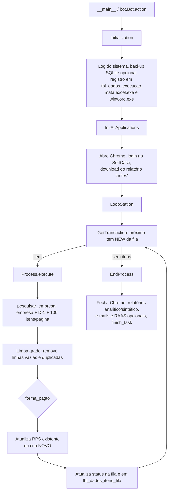

# ID01_3_ConcEst_LanctoRPS — Documentação do Projeto

> Documentação gerada a partir da leitura do código-fonte, do `Config.xlsx`, do banco SQLite versionado, do histórico Git e dos logs de execução enviados em `ID01_3_ConcEst_LanctoRPS.zip`.
> Nenhum arquivo do projeto foi alterado.

---

## 1. Visão geral

Robô RPA em **Python** que faz o **lançamento (criação/atualização) de RPS Consolidados** no portal **SoftCase** (`rps.portalsoftcase.com.br`) para a conciliação dos estacionamentos.

Ele consome uma **fila SQLite** (alimentada pelo projeto `ID01_2_ConcEst_TratarDados`) em que cada item representa o valor consolidado de uma **empresa × adquirente × forma de pagamento** do dia anterior (D-1). Para cada item, o robô abre a tela *RPS Consolidados* do SoftCase, filtra a empresa e a forma de pagamento e **edita o RPS existente** ou **cria um novo**, preenchendo `Valor`, `Total taxa` e `Dias Comp.`.

| Item | Valor |
|---|---|
| Nome do projeto | `ID01_3_ConcEst_LanctoRPS` |
| Descrição (Details_Project.json) | Faz conciliação dos Estacionamentos |
| Cliente (Details_Project.json) | Partage |
| Ferramenta | Python RPA (framework próprio, "VERSÃO FRAMEWORK: 1.0.0") |
| Automação web | Selenium 4 + Chrome (via `webdriver-manager`) |
| Sistemas de interação | Excel (`Config.xlsx`, relatórios), SQLite, sites (SoftCase) |
| Tipo de fila | SQLite |
| Versão (`VERSION`) | 1.0.0 |
| Equipe (README) | GP, RO e DEV: Felipe Mello |
| Repositório | GitHub — `maurovmorais/ID01_3_ConcEst_LanctoRPS` (branch `main`) |
| Sistema operacional | **Windows** (caminhos com `\`, `taskkill`, Gerenciador de Credenciais) |

---

## 2. Arquitetura e fluxo de execução



### 2.1 Ponto de entrada

- `python -m ID01_3_ConcEst_LanctoRPS` executa `__main__.py`, que chama `Bot.main()` (execução local) ou `Bot.action(None)` quando recebe `--execution` e pelo menos 5 argumentos.
- `Bot.action` executa `Initialization.execute()` → `LoopStation.execute()` e, **sempre**, `EndProcess.execute()`.
- Exceções são capturadas; se a falha for no processamento, ela é guardada em `InitAllSettings.exception_process` para o `EndProcess` reportar.

### 2.2 Inicialização (`Initialization`)

1. Loga informações de sistema, uso do computador e monitores.
2. Inicia o *Robot Stream* e/ou *backup do SQLite* **se habilitados** no Config.
3. Insere a execução em `tbl_dados_execucao` e atualiza a quantidade de itens da fila.
4. Envia e-mail inicial e inicia a gravação de tela **se habilitados**.
5. **Finaliza `excel.exe` e `winword.exe`** (`taskkill /f`) antes de iniciar.
6. Chama `InitAllApplications.execute(first_run=True)`.

Erros na inicialização (negócio ou aplicação) geram screenshot (se habilitado), e-mail (se habilitado), atualizam `tbl_dados_execucao` e interrompem a execução.

### 2.3 Inicialização das aplicações (`InitAllApplications`)

Até `MaxRetryNumber` tentativas:

1. Abre o Chrome (`headless=False`) com a pasta de download configurada em `relatorio_rps_antes`.
2. `fazer_login_softcase`.
3. `download_relatorio_softcase`: acessa `/softrps/rpsconsolidateds` e clica no botão de download — gera o **relatório "antes" das alterações**.

### 2.4 Loop de itens (`LoopStation` + `GetTransaction`)

- `GetTransaction` pega o próximo item (`QueueManagerPerformer.get_next_queue_item`) e atualiza contadores/logs.
- Para cada item, até `MaxRetryNumber` tentativas de `Process.execute()`.
- Ao final de cada item é feito o *update* do status na fila e em `tbl_dados_itens_fila`.
- Se `MaxConsecutiveSystemExceptions` (3) itens consecutivos terminarem com erro de sistema, o loop é interrompido.

### 2.5 Finalização (`EndProcess`)

1. Fecha o Chrome (`taskkill chrome.exe` e `chromedriver.exe`).
2. Finaliza o gravador de tela (se habilitado).
3. Atualiza `tbl_dados_execucao` e gera os relatórios **Analítico** e **Sintético** a partir dos templates `.xlsx`.
4. Envia e-mail final e dados do RAAS **se habilitados** (e apaga os arquivos gerados após o envio).
5. Chama `ExecutionControl.finish_task` com sucesso ou falha (inicialização / processamento).

---

## 3. Estrutura do projeto

```
ID01_3_ConcEst_LanctoRPS/
├── Details_Project.json        # Metadados (cliente, ferramenta, tipo de fila)
├── README.md  VERSION  setup.py  MANIFEST.in  requirements.txt
├── build.bat / build.sh        # python setup.py sdist
└── ID01_3_ConcEst_LanctoRPS/   # pacote Python
    ├── __main__.py  bot.py
    ├── classes/
    │   ├── framework/          # Ciclo de vida do robô
    │   │   ├── InitAllSettings.py        # Carrega Config.xlsx e prepara o Selenium
    │   │   ├── Initialization.py
    │   │   ├── InitAllApplications.py    # Login + download do relatório "antes"
    │   │   ├── LoopStation.py            # Loop, retries e tratamento de exceções
    │   │   ├── GetTransaction.py         # Captura o próximo item da fila
    │   │   ├── Process.py                # Regra de negócio principal
    │   │   ├── EndProcess.py  CloseAllApplications.py  KillAllProcesses.py
    │   ├── queue/              # QueueManagerPerformer (em uso) e QueueManager
    │   ├── site/               # Automação do SoftCase (ver seção 6)
    │   ├── utils/              # Log, datas, duplicadas, credenciais, etc.
    │   ├── dados_execucao/     # Registro da execução/itens no SQLite
    │   ├── relatorios/         # Relatórios analítico/sintético (+ CSV RAAS)
    │   ├── email/              # Envio/recebimento (SMTP, Outlook, Graph/API)
    │   ├── excel/  databases_manager/  chrome/
    └── resources/
        ├── config/Config.xlsx
        ├── sqlite/banco_dados.db         # Banco "modelo" (tabelas vazias)
        ├── scripts/analitico_sintetico/  # SQLs dos relatórios
        ├── templates/                    # E-mails (.txt) e relatórios (.xlsx)
        ├── logs/  relatorios/  videos/  exception/  robot_stream/
```

---

## 4. Instalação e execução

**Pré-requisitos**

- Windows com Google Chrome instalado.
- Python 3.13 (os `.pyc` do projeto foram gerados em CPython 3.13).
- Credencial genérica cadastrada no **Gerenciador de Credenciais do Windows** com o nome `site_softcase` (senha do portal).
- Acesso de leitura/escrita aos caminhos configurados em `Config.xlsx` (seção 5).
- Banco SQLite da fila disponível (seção 5.2).

**Instalação**

```bash
python -m venv .venv
.venv\Scripts\activate
pip install -e .
pip install pywin32      # necessário, mas ausente do requirements.txt (ver seção 11)
```

**Execução**

```bash
python -m ID01_3_ConcEst_LanctoRPS
```

**Empacotamento:** `build.bat` (ou `build.sh`) executa `python setup.py sdist`.

**Dependências (`requirements.txt`):** selenium 4.28.1, webdriver-manager 4.0.2, pandas 2.3.1, openpyxl 3.1.5, pyodbc 5.2.0, opencv-python 4.12.0.88, pyautogui 0.9.54, msal 1.32.3, beautifulsoup4 4.13.4, screeninfo 0.8.1, xlwings 0.33.15, setuptools 80.9.0, mysql-connector-python 9.3.0, psutil 6.1.1, numpy 2.2.1.

---

## 5. Configuração

### 5.1 `resources/config/Config.xlsx`

Abas lidas por `InitAllSettings.load_config()`: **Settings**, **Constants**, **Credentials** e **Assets** (formato chave/valor nas colunas A e B). Na versão enviada, a aba *Credentials* está vazia (só cabeçalho).

Chaves relevantes e valores atuais:

| Chave | Valor atual | Função |
|---|---|---|
| `NomeProcesso` | `ID01_3_ConcEst_LanctoRPS` | Nome usado nos logs e relatórios |
| `CaminhoBancoSqlite_Performer` | `C:\Armazenamento\ID01_2_ConcEst_TratarDados\Banco Dados\banco_dados.db` | **Banco real da fila** e dos dados de execução |
| `CaminhoBancoSqlite` | `C:\Armazenamento\ID01_3_ConcEst_LanctoRPS\Banco Dados\banco_dados.db` | Caminho do banco próprio (hoje não é o usado: o código prioriza a chave `_Performer`) |
| `FilaProcessamento` / `FilaProcessamentoPerformer` | `tbl_Fila_Proc_Performer` | Tabela usada como fila |
| `NomeTabelaDadosExecucao` | `tbl_dados_execucao` | Cabeçalho de cada execução |
| `NomeTabelaDadosItens` | `tbl_dados_itens_fila` | Detalhe de cada item processado |
| `usuarios` | conta de automação do SoftCase | Usuário do login (a senha vem do Windows) |
| `relatorio_rps_antes` | `C:\Armazenamento\ID01_3_ConcEst_LanctoRPS\Dados_RPSs_Antes` | Pasta de download do relatório "antes" |
| `CaminhoPastaRelatorios` | `...\Relatorios` | Saída dos relatórios analítico/sintético |
| `CaminhoExceptionScreenshots` | `...\Screenshtos` | Screenshots de erro (grafia do Config) |
| `CaminhoAnexo`, `CaminhoPastaLogs`, `CaminhoSalvarVideo` | `...\Anexos`, `...\Logs`, `...\Videos` | Pastas de apoio |
| `MaxRetryNumber` | `3` | Tentativas por item / por abertura de aplicações |
| `MaxConsecutiveSystemExceptions` | `3` | Máx. de erros de sistema consecutivos antes de parar |
| `EmailInicial`, `EmailCadaErro`, `EmailErroInicializacao`, `EmailFinal` | `NÃO` | Envios de e-mail desativados |
| `CapturarScreenshot`, `GravarTela`, `IniciarRobotStream`, `BackupSqlite`, `AtivarLogs`, `RelatorioRAAS` | `NÃO` | Recursos opcionais desativados |
| `NomeCliente` | `IAFastLab` | Usado nas tabelas de relatório |

Campos obrigatórios validados na partida: `NomeCliente`, `NomeProcesso`, `DescricaoProcesso`, `CaminhoExceptionScreenshots`, `CaminhoPastaRelatorios`.

### 5.2 Fila e banco de dados

A tabela de fila usada em produção (`tbl_Fila_Proc_Performer`) fica no banco do projeto **ID01_2_ConcEst_TratarDados** (via `CaminhoBancoSqlite_Performer`). O `banco_dados.db` que acompanha este projeto contém apenas as tabelas modelo, **vazias**: `tbl_Fila_Processamento`, `tbl_dados_execucao` e `tbl_dados_itens_fila`.

**Estrutura esperada da tabela de fila**

| Coluna | Descrição |
|---|---|
| `id` | Chave primária |
| `referencia` | Chave de roteamento, no formato `Adquirente/Forma` (ex.: `Cielo/Pix`) |
| `datahora_criado` | Data/hora de criação |
| `nome_maquina` | Recebe o GUID da execução que reservou o item |
| `info_adicionais` | JSON com os dados do lançamento (abaixo) |
| `status` | Estado do item |
| `obs` | Observação/erro |
| `ultima_atualizacao` | Última alteração |

**Conteúdo de `info_adicionais`** — o robô lê o **primeiro elemento da lista** (`info_adicionais[0]`):

| Campo | Uso |
|---|---|
| `adquirente` | Adquirente (Cielo, Veloe, Greenpass, ConectCar, SemParar, Bradesco) |
| `softcase` | Nome da empresa exatamente como aparece no SoftCase |
| `forma_pagto` | Forma recebida (ex.: `Pix`, `DEBITO`, `Crédito à vista`, `TAG`) |
| `forma_pagamento` | Texto da forma de pagamento **no SoftCase**, usado nos filtros e no NOVO |
| `bandeira` | Bandeira (normalizada para maiúsculas; vazio vira `None`) |
| `valor` | Valor do RPS |
| `valor_taxa` | Valor do campo *Total taxa* |
| `dias_comp` | Valor do campo *Dias Comp.* |

**Ciclo de status**

```
NEW → ON QUEUE → RUNNING → SUCESSO | BUSINESS ERROR | APP ERROR
                                  (ABANDONED: via abandon_queue, para itens NEW)
```

A reserva do item é feita com `UPDATE ... WHERE id = (SELECT MIN(id) ... WHERE status='NEW')`, gravando o GUID da execução em `nome_maquina`.

---

## 6. Automação do SoftCase (`classes/site`)

### 6.1 Navegação

| Etapa | Detalhe |
|---|---|
| Login | `https://rps.portalsoftcase.com.br/` — usuário vem do Config (`usuarios`), senha do Gerenciador de Credenciais (`site_softcase`); até 3 tentativas |
| Tela de trabalho | `/softrps/rpsconsolidateds` (RPS Consolidados) |
| Filtros | Empresa (dropdown), Data inicial e Data final = **D-1**, itens por página = 100, botão Pesquisar |
| Edição | Ações → Editar → diálogo *Editar RPS Consolidado* → campos `Valor`, `Total taxa` (e `Dias Comp.` quando aplicável) → Atualizar |
| Criação | Botão NOVO → diálogo *Criar RPS Consolidado* → Empresa, Data (D-1), Forma de pagamento, Valor, Quantidade = `1`, Total taxa, Dias Comp. (padrão `0`) → Salvar |

O portal usa **MudBlazor**; por isso há tratamento específico para autocompletes, calendários e listas (`softcase_forma_pagamento.py`, `util_data.py`, `softcase_selecionar_qtde_itens.py`). Campos Blazor só registram o valor no evento *change*, então os preenchimentos terminam com `TAB`.

### 6.2 Módulos

| Módulo | Responsabilidade |
|---|---|
| `softcase.py` | Login, `pesquisar_empresa`, `filtrar_forma_pagto`, `atualizar_dados`, `editar_rps_consolidado`, download do relatório "antes", diagnóstico em HTML/PNG (`logs/diagnostico`) |
| `softcase_forma_pagamento.py` | Seleção de autocomplete **validada pelo resultado**: se uma ocorrência da forma de pagamento retornar a grade vazia (`0-0 of 0`), tenta a próxima ocorrência |
| `softcase_selecionar_qtde_itens.py` | Define 100 itens por página |
| `softcase_remover_linha_vazia.py` | Remove linhas com `SAP Doc. (AUART)` ou `SAP Pgto. Id.(KUNNR)` vazios (limite de 100 iterações) |
| `lancamento_pix.py` | Pix: atualiza ou cria |
| `credito_pre_pago.py` | Crédito pré-pago: atualiza ou cria |
| `lancamento_conversor_moedas.py` | Crédito conversor de moedas: atualiza ou cria |
| `lancamento_dinheiro.py` | Dinheiro: atualiza ou cria |
| `lancamento_tag.py` | TAG: somente atualiza |
| `credito_pre_pago_v1.py` | Versão anterior do pré-pago (não importada pelo fluxo atual) |
| `softcase_remover_linha_debito.py` | Remove duplicatas por forma de pagamento mantendo a de maior valor (importada, mas **não chamada** no fluxo atual) |

### 6.3 Utilitários de apoio (`classes/utils`)

| Módulo | Responsabilidade |
|---|---|
| `remover_linhas_duplicadas.py` | Analisa o HTML da grade (BeautifulSoup) e identifica duplicadas |
| `excluir_linhas_softcase.py` | Exclui a linha no portal (Ações → Excluir → Confirmar), localizando-a pelo `Numero` |
| `util_data.py` | Calendário MudBlazor (`definir_data`) e `obter_intervalo_ontem()` |
| `CredentialWindows.py` | Lê credencial genérica via `win32cred` |
| `Log.py` | Logger (console + arquivo `resources/logs/execucao_AAAAMMDD.log`) |
| `ExecutionControl.py` | Dados de execução local (runner = hostname); `is_interrupted()` retorna sempre `False` |

---

## 7. Regras de negócio

### 7.1 Preparação da grade (antes de cada lançamento)

1. **Linhas incompletas:** exclui toda linha em que `SAP Doc. (AUART)` ou `SAP Pgto. Id.(KUNNR)` esteja vazio.
2. **Linhas duplicadas:** duas linhas são duplicadas quando têm o **mesmo `Dias Comp.`** e **`Forma de pagamento` com similaridade ≥ 90%** (após normalizar caixa, acentos e símbolos). Mantém a primeira da tabela e exclui as demais pelo botão Ações → Excluir.

### 7.2 Roteamento por `referencia`

`Process.FORMA_PAGTO_SOFTCASE` define as referências aceitas:

| Referência | `forma_pagto` esperada | Tratamento |
|---|---|---|
| `Cielo/Pix` | Pix | `lancar_pix` — atualiza ou cria |
| `Bradesco/PIX` | PIX | `lancar_pix` — atualiza ou cria |
| `Cielo/Crédito pré-pago` | Crédito pré-pago | `lancar_credito_pre_pago` — atualiza ou cria |
| `Cielo/Crédito conversor de moedas` | Crédito conversor de moedas | `lancar_credito_conversor_moedas` — atualiza ou cria |
| `Cielo/DINHEIRO` | DINHEIRO | `lancar_dinheiro` — atualiza ou cria (comentário no código: "CONFIRMAR a referência") |
| `Cielo/DEBITO` | DEBITO | `_lancar` — filtra e atualiza o RPS existente |
| `Cielo/Crédito à vista` | Crédito à vista | `_lancar` — idem, **atualizando também `Dias Comp.`** |
| `ConectCar/TAG`, `Greenpass/TAG`, `SemParar/TAG`, `Veloe/TAG` | TAG | `atualizar_tag` — filtra e atualiza (**não cria**) |

### 7.3 Lógica "atualiza ou cria"

- **Pix, pré-pago e conversor de moedas:** filtra a forma de pagamento e verifica se a grade tem uma linha da empresa. Se tiver, edita; se não tiver (ou a grade vier vazia), cria um NOVO.
- **Dinheiro:** filtra; se não houver registro para alterar (grade vazia), cria um NOVO.
- **Débito, crédito à vista e TAG:** apenas filtram e editam; se não houver RPS, o item falha.
- Em todas as criações, a data do lançamento é **D-1**, a quantidade é `1` e `Dias Comp.` vazio vira `0`.

### 7.4 Tratamento de erros por item

| Situação | Comportamento |
|---|---|
| Sucesso | Status `SUCESSO` na fila e em `tbl_dados_itens_fila` |
| `BusinessRuleException` | Sem nova tentativa; status `BUSINESS ERROR`; screenshot/e-mail se habilitados |
| `TerminateException` | Tratada como sucesso do item |
| Demais exceções (sistema) | Registra falha, fecha `chrome.exe`, **reinicia as aplicações** (`InitAllApplications.execute(first_run=False)`) e tenta de novo, até `MaxRetryNumber`. Na última tentativa, status `APP ERROR` |
| Erros de sistema consecutivos ≥ `MaxConsecutiveSystemExceptions` | Interrompe o loop |

---

## 8. Registro de execução e relatórios

- **Logs:** `resources/logs/execucao_AAAAMMDD.log`.
- **`tbl_dados_execucao`:** uma linha por execução (GUID, máquina, resolução, início/fim, tempo, quantidades de sucesso/negócio/aplicação, exceção de inicialização).
- **`tbl_dados_itens_fila`:** uma linha por tentativa de item (referência, JSON do item, início/fim, status, tipo e descrição da exceção, screenshot).
- **Relatórios:** `Relatorio_Analitico.xlsx` e `Relatorio_Sintetico.xlsx`, preenchidos a partir dos scripts em `resources/scripts/analitico_sintetico/`. Quando `EmailFinal = SIM` são enviados por e-mail e depois apagados.
- **RAAS:** gera CSVs analítico/sintético e envia por SMTP quando `RelatorioRAAS = SIM` e a execução não é de teste.
- **Templates de e-mail:** `Email_Inicio.txt`, `Email_Final.txt`, `Email_ErroEncontrado.txt`.

**Amostra dos logs enviados (10/10/2026):** 19 itens processados no dia, sem nenhuma linha de nível ERROR. Distribuição por referência: `Cielo/Pix` (7), `Cielo/Crédito pré-pago` (5), `Cielo/DEBITO` (2), `Cielo/Crédito conversor de moedas` (2), `Cielo/Crédito à vista` (1), `Greenpass/TAG` (1), `ConectCar/TAG` (1).

---

## 9. Pastas externas utilizadas

Todas sob `C:\Armazenamento\ID01_3_ConcEst_LanctoRPS\` (conforme Config): `Dados_RPSs_Antes`, `Relatorios`, `Logs`, `Screenshtos`, `Anexos`, `Videos`, `Banco Dados`. A fila e os dados de execução ficam em `C:\Armazenamento\ID01_2_ConcEst_TratarDados\Banco Dados\`.

---

## 10. Histórico Git

| Commit | Data | Descrição |
|---|---|---|
| `d262e17` | 13/09/2026 | first commit |
| `5ee8731` | 30/09/2026 | adiciona logica pegar fila |
| `348c012` | 01/10/2026 | corrigi nome da variavel |
| `72203e2` | 03/10/2026 | adiciona regras de lançto |
| `6deda8d` | 04/10/2026 | adiciona regras das TAGs |
| `09335aa` | 07/10/2026 | adiciona lancamento dinheiro |

Alterações em arquivos de 08 a 10/10/2026 (`credito_pre_pago.py`, `lancamento_conversor_moedas.py`, `lancamento_tag.py`, `Process.py`, `InitAllApplications.py`, entre outros) aparecem com data posterior ao último commit; confira o `git status` do seu repositório.

---

## 11. Pontos de atenção observados

1. **Dependência faltando:** o código importa `win32api`, `win32com` e `win32cred` (pywin32), mas o pacote não está no `requirements.txt`.
2. **Referência desconhecida vira sucesso:** se `referencia` não estiver em `FORMA_PAGTO_SOFTCASE`, o `Process` só registra log e retorna; o item acaba marcado como `SUCESSO` sem ter sido lançado.
3. **`taskkill` global na inicialização:** `excel.exe` e `winword.exe` são encerrados à força, o que pode fechar arquivos abertos de outros usuários/processos da máquina.
4. **Reabertura repete o download "antes":** a cada falha de sistema, `InitAllApplications.execute` refaz login **e** o download do relatório "antes".
5. **`Process` chama `remover_linhas_duplicadas` duas vezes:** a primeira exclui; a segunda (sem exclusão) serve para o log "Duplicadas encontradas", que portanto tende a mostrar 0 após a limpeza.
6. **Parâmetro `bandeira` sem efeito:** `filtrar_forma_pagto` recebe `bandeira`, mas não a utiliza; a distinção de bandeira depende do texto de `forma_pagamento` vindo da fila.
7. **XPaths absolutos:** vários seletores (`/html/body/div[1]/...`) quebram com qualquer mudança de layout do portal. Os dos formulários NOVO se repetem em quatro módulos (pix, dinheiro, pré-pago, conversor), o que multiplica a manutenção.
8. **Código legado:** `QueueManager` (fila antiga), `credito_pre_pago_v1.py`, `softcase_remover_linha_debito.py` e várias importações não usadas permanecem no projeto.
9. **Metadados inconsistentes:** `README.md` ainda tem o bloco de releases como modelo e descreve o projeto como "conciliação"; `setup.py` usa `description="modelo"`; `MANIFEST.in` referencia `README.rst` (o arquivo é `README.md`); `NomeCliente` no Config (`IAFastLab`) difere do cliente em `Details_Project.json` (`Partage`); `versao_runner` está como `"X.X.X"`.
10. **Integração com orquestrador:** `ExecutionControl.is_interrupted()` sempre retorna `False`; não há interrupção remota.
11. **Caminhos Windows fixos:** vários caminhos usam `\` literal (`InitAllSettings`), então o projeto não roda em Linux/macOS sem ajustes.
12. **Sem testes automatizados:** não há pasta `tests/` nem uso de `pytest`.
